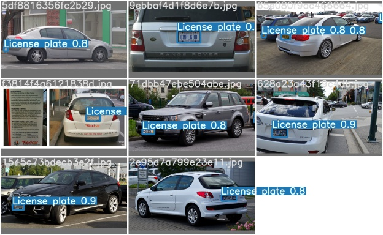

# Car plate detection and recognition

For detection [Scaled YoLOv4](https://github.com/WongKinYiu/ScaledYOLOv4/tree/yolov4-large) was used. For recognition - pytesseract.

Every step is in Jupyter Notebook

# Results

# [Dataset](https://drive.google.com/drive/folders/1M7jQFO_m-5cBrvkioDCM3LKOlNllUMqM?usp=sharing)

# TO-DO
  -   Warp prospective for convenient and more precise recognition